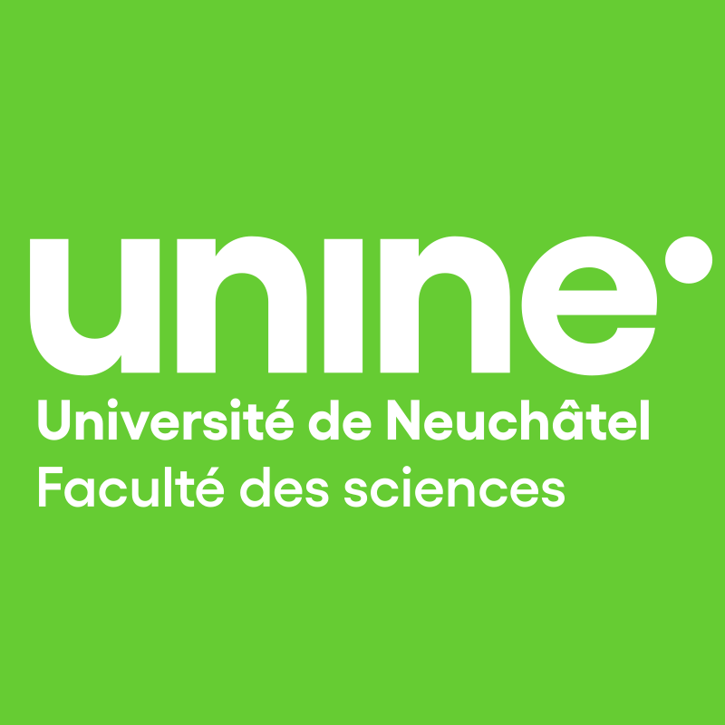

## Welcome!

I'm currently working as a Postdoc at the Institute of Computer Science of the University of Neuchâtel, Switzerland.
My current research interests are data plane-programmable network switches, most notably the Intel Tofino platform.

I obtained my Ph.D. degree in late 2022 under the supervision of Prof. Pascal Felber.

Below, you will find an up-to-date list of the scientific articles that I (co-)authored.

Finally, you will find a [contact form](#contact-form) at the bottom of the page.

### Scientific publications

In principle, publications are also indexed by [Google Scholar](https://scholar.google.fr/citations?user=K1yM-cYAAAAJ) and [DBLP](https://dblp.org/pers/hd/v/Vaucher:S=eacute=bastien).



### Work experience

    <a href="https://www.unine.ch/iiun" class="collection-item avatar">
        
        Postdoc
        
Computer science department, Université de Neuchâtel 2023-

    </a>
    <a href="https://www.cisco.com/" class="collection-item avatar">
        
        Software engineer (Intern)
        
Cisco Systems Switzerland Sept.-Dec.&nbsp;2020

    </a>

### Education

    <a href="https://www.unine.ch/iiun" class="collection-item avatar">
        
        Ph.D. in Computer Science
        
Université de Neuchâtel 2017-2022

    </a>
    <a href="https://mcs.unibnf.ch/" class="collection-item avatar">
        
        Swiss Joint Master in Computer Science
        
Université de Neuchâtel, Universität Bern, Université de Fribourg 2014-2016

    </a>
    <a href="https://www.he-arc.ch/ingenierie" class="collection-item avatar">
        
        Bachelor of Science HES-SO in Computer Science
        
Haute École Arc Ingénierie 2011-2014

    </a>
    <a href="https://www.cpne.ch/" class="collection-item avatar">
        
        CFC en informatique &amp; Maturité professionnelle technique
        
Centre Professionnel du Littoral Neuchâtelois 2008-2011

    </a>



