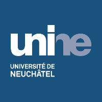
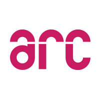
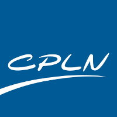

## Welcome!

Hi there! My name is Sébastien Vaucher, I'm a software engineer from the region of Neuchâtel, Switzerland. If you're here, it's probably because you want to know more about me. 

I hope that you will find what you are looking for on this website. Below is a summary of my education amd a list of projects I realized.

Should you be unable to find something, you can instantly contact me using the chat button in the lower right. It will start an XMPP/Jabber chat with me.

Happy browsing!

### Education

<ul class="collection">
    <li class="collection-item avatar">
        
        Swiss Joint Master in Computer Science
        
Université de Neuchâtel 2014-2016

        <a href="http://mcs.unibnf.ch/" class="secondary-content"><i class="mdi mdi-launch"></i></a>
    </li>
    <li class="collection-item avatar">
        
        Bachelor of Science HES-SO in Computer Science
        
Haute École Arc Ingénierie 2011-2014

        <a href="http://www.he-arc.ch/ingenierie" class="secondary-content"><i class="mdi mdi-launch"></i></a>
    </li>
    <li class="collection-item avatar">
        
        CFC en informatique &amp; Maturité professionnelle technique
        
Centre Professionnel du Littoral Neuchâtelois 2008-2011

        <a href="http://www.cpln.ch/" class="secondary-content"><i class="mdi mdi-launch"></i></a>
    </li>
</ul>

### Projects

Below is a list of some projects I realized since 2010.

You can read a summary for any project by using the Show details action. Some projects are open-source and available on Github.



